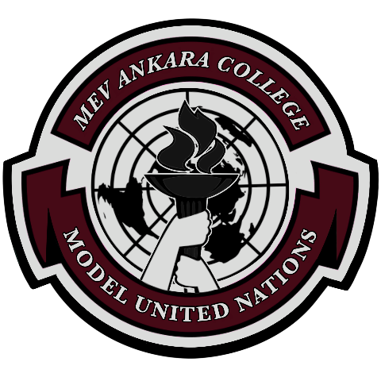

# MACMUN The Sequel

Model United Nations (MUN) is an event designed to facilitate debates among students on topics concerning the United Nations, aiming to promote both social interaction among participants and the improvement of their English skills. <a href="https://the-sequel.mevcollegemun.org" target="_blank">Mev College Model United Nations</a> is a Model United Nations simulation organized by Ankara MEV Highschool. As a student of the school, I was also the head of the IT team and it was my responsibility to create the website.

## Purpose of the Site
To ensure the event's visibility in search engines and encourage those who are undecided to join the event.

# Code Overview

## Dependencies
- [body-parser](https://www.npmjs.com/package/body-parser) - Used to facilitate URL processing.
- [cookie-parser](https://www.npmjs.com/package/cookie-parser) - Used to store the site language in cookies for user convenience.
- [dotenv](https://www.npmjs.com/package/dotenv) - Used to easily modify configurable parameters.
- [ejs](https://www.npmjs.com/package/ejs) - Used for server-side page rendering.
- [express](https://www.npmjs.com/package/express) - Used to set up an HTTP server.
- [mongoose](https://www.npmjs.com/package/mongoose) - Used to simplify database operations for tracking user counts.
- [nodemailer](https://www.npmjs.com/package/nodemailer) - Used to send emails to authorities regarding user counts.

## Application Structure
- `server.js` - The entry point of the application. After setting up the server with Express, it establishes a connection with MongoDB and handles the routers.
- `controllers/` -  Implements the MVC (Model-View-Controller) structure to enhance the development process by separating the functions.
- `data/` - A directory where frequently changing data is stored.
- `models/` - Contains the code for database operations.
- `routes/` - Implements the MVC structure to facilitate better management of routers and improve the development process.

> # Preview

You can view the front-end code <a href="https://the-sequel.mevcollegemun.org" target="_blank">here</a>.

> # Missing Pages

- The missing pages in the `/conference` directory are ready, but they are being redirected to a coming-soon page because the Ministry of National Education has not granted permission for their release.
- The individuals who should have their photos in the `/academic-team` and `/organization-team` directories are prohibited by law from sharing their photos because they have not signed the **KVKK** (Personal Data Protection Law) text.
