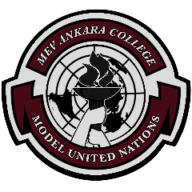

# MACMUN The Sequel

Birleşmiş Milletler Simülasyonu(MUN) öğrenciler arasında birleşmiş milletleri ilgilendiren konular hakkında münazara yapılması üzerine kurulan hem katılanların sosyalleşmesi hem de ingilizcelerini geliştirmeyi hedefleyen etkinliktir. <a href="https://mevcollegemun.web.app/" target="_blank">Mev College Model United Nations'ta</a> ise Özel Ankara MEV Okulu tarafından yapılan birleşmiş milletler simülasyonudur. Okulun bir öğrencisi olarak ben de BT takımının başında yer aldım ve siteyi yapmak benim görevimdi.

## Sitenin Amacı
Yapılan etkinliğin arama motorlarında çıkmasını sağlamak ve etkinliğe katılmak konusunda kararsız kalanların etkinliğe dahil olmalarını sağlamak.

# Kodun Özeti

## Gereklilikler
- [body-parser](https://www.npmjs.com/package/body-parser) - Url işlemlerini kolaylaştırmak için kullanıldı.
- [cookie-parser](https://www.npmjs.com/package/cookie-parser) - Site dilini çerezlere kaydederek kullanıcının işini kolaylaştırmak için kullanıldı.
- [dotenv](https://www.npmjs.com/package/dotenv) - Değişebilir parametreleri kolayca değiştirebilmek için kullanıldı.
- [ejs](https://www.npmjs.com/package/ejs) - Sunucu tarafında sayfa işlemek için kullanıldı.
- [express](https://www.npmjs.com/package/express) - HTTP sunucusu kurmak için kullanıldı.
- [mongoose](https://www.npmjs.com/package/mongoose) - Kullanıcı sayılarını takip etmek için kullanılan veri merkezinin işlemlerini kolaylaştırmak için kullanıldı.
- [nodemailer](https://www.npmjs.com/package/nodemailer) - Kullanıcı sayılarını yetkililere e-posta yollamak için kullanıldı.

## Uygulama Mimarisi
- `server.js` - Uygulamanın başlangıç noktası. Express ile sunucu kurulduktan sonra mongodb ile bağlantı sağlanır ve yönlendiriciler işlenir.
- `controllers/` - Fonksiyonları geliştirme sürecini daha sağlıklı hale getirmek için MVC yapısı kullanıldı.
- `data/` - Sık değişen verilerin depolandığı yer.
- `models/` - Veri merkezi işlemlerinin kodlarını içerir.
- `routes/` - Yönlendiricileri daha kolay yönetebilmek ve geliştirme sürecini daha sağlıklı hale getirmek için MVC yapısı kullanıldı.

> # Ön İzleme

Ön uç kodlarını <a href="https://mevcollegemun.web.app/" target="_blank">buradan</a> görebilirsiniz.
Not: Link sadece ön uç kodlarını gösterir ve linkte arka uç gerektiren kodlar çalışmamaktadır. Arka uç kodlarına bu repository'den ulaşabilirsiniz.

> # İngilizce README dosyası
<a href="https://github.com/Dev-Emree/MACMUN-The-Sequel-Web-Site/blob/main/README.en.md">Buradan</a> ulaşabilirsiniz.
